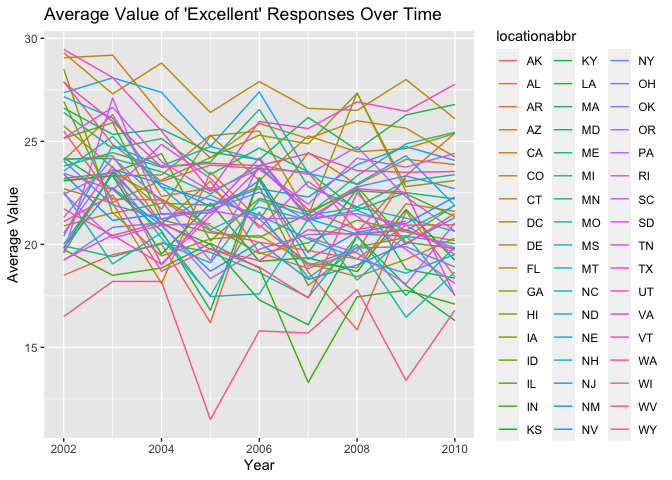

p8105_hw3_ys3765
================
Yixiao Sun
2023-10-09

\#Load packages

``` r
library(tidyverse)
```

    ## ── Attaching core tidyverse packages ──────────────────────── tidyverse 2.0.0 ──
    ## ✔ dplyr     1.1.3     ✔ readr     2.1.4
    ## ✔ forcats   1.0.0     ✔ stringr   1.5.0
    ## ✔ ggplot2   3.4.4     ✔ tibble    3.2.1
    ## ✔ lubridate 1.9.2     ✔ tidyr     1.3.0
    ## ✔ purrr     1.0.2     
    ## ── Conflicts ────────────────────────────────────────── tidyverse_conflicts() ──
    ## ✖ dplyr::filter() masks stats::filter()
    ## ✖ dplyr::lag()    masks stats::lag()
    ## ℹ Use the conflicted package (<http://conflicted.r-lib.org/>) to force all conflicts to become errors

``` r
library(p8105.datasets)
library(ggplot2)
```

\#Problem 2

``` r
library(p8105.datasets)
data("brfss_smart2010")

df1 = brfss_smart2010%>%
  janitor::clean_names()

dic_levels = c("Poor","Fair","Good","Very good","Excellent")

df1_grouped<-df1%>%
  group_by(topic = "Overall Health")%>%
  filter(response %in% dic_levels)

df1_grouped_ordered<-df1_grouped %>%
  mutate(response = factor(response,levels = c("Poor","Fair","Good","Very good","Excellent"), ordered=TRUE))
```

``` r
states_2002 <- df1_grouped_ordered %>%
  filter(year == 2002) %>%
  distinct(locationabbr,locationdesc)%>%
  count(locationabbr)%>%
  filter(n >= 7)

print(states_2002)
```

    ## # A tibble: 6 × 3
    ## # Groups:   topic [1]
    ##   topic          locationabbr     n
    ##   <chr>          <chr>        <int>
    ## 1 Overall Health CT               7
    ## 2 Overall Health FL               7
    ## 3 Overall Health MA               8
    ## 4 Overall Health NC               7
    ## 5 Overall Health NJ               8
    ## 6 Overall Health PA              10

``` r
states_2010 <- df1_grouped_ordered %>%
  filter(year == 2010) %>%
  distinct(locationabbr,locationdesc)%>%
  count(locationabbr)%>%
  filter(n >= 7)

print(states_2010)
```

    ## # A tibble: 14 × 3
    ## # Groups:   topic [1]
    ##    topic          locationabbr     n
    ##    <chr>          <chr>        <int>
    ##  1 Overall Health CA              12
    ##  2 Overall Health CO               7
    ##  3 Overall Health FL              41
    ##  4 Overall Health MA               9
    ##  5 Overall Health MD              12
    ##  6 Overall Health NC              12
    ##  7 Overall Health NE              10
    ##  8 Overall Health NJ              19
    ##  9 Overall Health NY               9
    ## 10 Overall Health OH               8
    ## 11 Overall Health PA               7
    ## 12 Overall Health SC               7
    ## 13 Overall Health TX              16
    ## 14 Overall Health WA              10

For year 2022, these following 6 states were observed at 7 or more
locations:CT, FL, MA, NC, NJ, PA.

For year 2010, these following 14 states were observed at 7 or more
locations:CA, CO, FL, MA, MD, NC, NE, NJ, NY, OH, PA, SC, TX, WA.

For this graph, the plot shows in each state the line pattern of people
giving excellent response from year 2002 to year 2010.

``` r
excellent<-df1_grouped_ordered%>%
  filter(response == "Excellent")%>%
  group_by(year,locationabbr)%>%
  summarise(average = mean(data_value),.groups='drop')

ggplot(excellent, aes(x = year, y = average, group = locationabbr, color = locationabbr)) +
  geom_line() +
  labs(title = "Average Value of 'Excellent' Responses Over Time", 
       x = "Year", 
       y = "Average Value")
```

    ## Warning: Removed 3 rows containing missing values (`geom_line()`).

<!-- -->

This following plot is used to compare the data value in NY between year
2006 and year 2010 in different response group(From “Poor” to
“Excellent”). It can be seen from the plot that though other classes
responses didn’t make much differences, the overall values of the
response “Very good” in 2010 is higher than that of 2006.

``` r
ny_data <- df1_grouped_ordered %>%
  filter(year %in% c(2006, 2010), locationabbr == "NY")

# Make a two-panel plot
ggplot(ny_data, aes(x = response, y = data_value)) +
  geom_boxplot() +
  facet_grid(~year) +
  labs(title = "Distribution of Data Value in NY for 2006 and 2010", 
       x = "Response", 
       y = "Data Value")
```

<!-- -->

\#Problem 3

``` r
nhanes_accel <- read_csv("data/nhanes_accel.csv")%>%
  janitor::clean_names()%>%
  pivot_longer(min1:min1440,names_to = "table",values_to = "value")
```

    ## Rows: 250 Columns: 1441
    ## ── Column specification ────────────────────────────────────────────────────────
    ## Delimiter: ","
    ## dbl (1441): SEQN, min1, min2, min3, min4, min5, min6, min7, min8, min9, min1...
    ## 
    ## ℹ Use `spec()` to retrieve the full column specification for this data.
    ## ℹ Specify the column types or set `show_col_types = FALSE` to quiet this message.

``` r
nhanes_covar <- read_csv("data/nhanes_covar.csv", skip = 4) %>%
  janitor::clean_names()%>%
  mutate(sex = recode(sex,`1` = "Male", `2`= "Female"),
         education = recode(education,
                            `1` = "Less than high school", 
                            `2` = "High school equivalent", 
                            `3` = "More than High School" ))%>%
  na.omit()
```

    ## Rows: 250 Columns: 5
    ## ── Column specification ────────────────────────────────────────────────────────
    ## Delimiter: ","
    ## dbl (5): SEQN, sex, age, BMI, education
    ## 
    ## ℹ Use `spec()` to retrieve the full column specification for this data.
    ## ℹ Specify the column types or set `show_col_types = FALSE` to quiet this message.

``` r
view(nhanes_covar)
merge_data<-left_join(nhanes_covar,nhanes_accel,by = "seqn")

clean_data <- merge_data %>%
  filter(age >= 21) %>%
  mutate(education = factor(education, levels = c("Less than high school", 
                                                  "High school equivalent", 
                                                  "More than High School"), 
                            ordered = TRUE))
```

This is the first step, to import, clean, and combine the `nhanes_accel`
and `nhanes_covar` datasets. I used the `pivot_longer` function to tidy
the `nhanes_accel` dataset so it can be more clear for us to see more
values. And using `mutate` ,`recode`, and `factor` function to set
levels for the variables “Education Level” and “Sex”. And the final
merged dataset,after exclude the participants less than 21 years of age
and those who has missing values, the `clean_data` has in total 328320
rows and 7 columns.

This following table is to show the number of men and women in each
education category. And with the following visualization of age
distributions for men and women in each education category, we can see
that for “Less than High School” and “More than High School” groups of
education level, the age differences are subtle between men and women.
However, for the education level of “High School Equivalent”, the
overall age for man to attend High School is younger than that of woman.

``` r
education_gender_table <- clean_data %>%
  group_by(education, sex) %>%
  summarize(n_obs = n(),.groups = "drop")

print(education_gender_table)
```

    ## # A tibble: 6 × 3
    ##   education              sex    n_obs
    ##   <ord>                  <chr>  <int>
    ## 1 Less than high school  Female 40320
    ## 2 Less than high school  Male   38880
    ## 3 High school equivalent Female 33120
    ## 4 High school equivalent Male   50400
    ## 5 More than High School  Female 84960
    ## 6 More than High School  Male   80640

``` r
clean_data_plot = 
  clean_data %>%
  ggplot(aes(x = education, y = age, color =sex)) +
  geom_boxplot() +
  labs(title = "Age Distributions by Gender and Education", x = "Education", y = "Age")
clean_data_plot
```

<!-- -->

This following graph shows the activities differences between men and
women of tatal activities in a 24-hour period in different education
level across ages. All of these trend lines shows that as the age of
person. increases, no matter which gender she or he is, after reaching a
maximum point, would continue to decrease. And for the three education
levels, male who is at “Less than High School” education level has a
overall higher trend line than that of female. However, for the rest of
two education levels, female shows higher daily activities value than
male even though the age continues to grow.

``` r
total<- clean_data%>%
        group_by(clean_data$seqn)%>%
        mutate(total = sum(value))%>%
        filter(table == "min1")

ggplot(total,aes(x = age, y = total,color = sex))+
  geom_point()+
  geom_smooth(se = TRUE)+
  facet_grid(~education)+
  labs(title = "Total Activity vs Age by Education and Gender")
```

    ## `geom_smooth()` using method = 'loess' and formula = 'y ~ x'

<!-- -->

This following plot shows the activities differences between men and
women for one day particular in a 24-hour period in different education
level across ages. From the first two education level, “Less than High
School”, and “High School Equivalent”, the overall trend line and table
points shows nearly no difference. For the level “More than High
School”, the activities of both male and female in around min500 and
min1250 are strongly high, especially for male in min1250(around 8
o’clock in the evening).

``` r
clean_data_final<-clean_data%>% mutate(table = as.numeric(str_replace_all(table,"min","")))
ggplot(clean_data_final, aes(x = table, y = value,color = sex))+
  geom_point(alpha = 0.5)+
  geom_smooth()+
  facet_wrap(~education)+
  labs(title = "Activity time over 24-Hours by Education and Gender")
```

    ## `geom_smooth()` using method = 'gam' and formula = 'y ~ s(x, bs = "cs")'

<!-- -->
